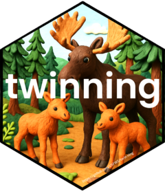

<!-- badges: start -->
[](https://lifecycle.r-lib.org/articles/stages.html#experimental){fig-alt="Lifecycle is experimental"}
<!-- badges: end -->

```{r, include = FALSE}
knitr::opts_chunk$set(
  collapse = TRUE,
  comment = "#>",
  fig.path = "man/figures/README-",
  out.width = "100%"
)
```

# twinning <a href="https://github.com/USFWS/moosetwinning"></a>

## Overview

This R package imports moose twinning data, estimates twinning rates, generates plots and summary tables, and produces a survey report. Originally developed for [Tetlin National Wildlife Refuge's moose twinning survey](https://iris.fws.gov/APPS/ServCat/Reference/Profile/145850), but could be adopted to other similar surveys. Generates a report that follows the [AK Refuge Report Series template](https://github.com/USFWS/akrreport). 

## Installation

To use `moosetwinning` and generate reports, you’ll need:

1.  **R version \>4.0** Available through FWS Apps-to-Go

2.  **Rtools version \>4.0** Available through FWS Apps-to-Go

3. A version of [RStudio](https://posit.co/download/rstudio-desktop/) that includes [Quarto](https://quarto.org/)

To install `moosetwinning`:  
``` r
if (!require("pak")) install.packages("pak")  
pak::pak("USFWS/moosetwinning")  
library(moosetwinning)
```

## Usage

To generate a example moose twinning report using data supplied with the package:

``` r
library(moosetwinning)
create_report()
```

To create a report using your data, provide a relative file path to a CSV containing moose twinning data. For example:

``` r
create_report("./data/dat.csv")
```

Data in the CSV should be formatted to the required standard. See example:

``` r
data("moose_twinning")
View(moose_twinning)
```

For more information, check out the package [GitHub page](usfws.github.io/moosetwinning/).


## Getting help

Contact the [project maintainer](emailto:mccrea_cobb@fws.gov) for help
with this repository.

## Contribute

Contact the [project maintainer](emailto:mccrea_cobb@fws.gov) for
information about contributing to this repository template. Submit a
[GitHub Issue](https://github.com/USFWS/moosetwinning/issues) to
report a bug or request a feature or enhancement.

------------------------------------------------------------------------

{fig-alt="Creative Commons Zero Universal v1.0 License"} This work is licensed under a [Creative Commons Zero Universal v1.0 License](https://creativecommons.org/publicdomain/zero/1.0/).
